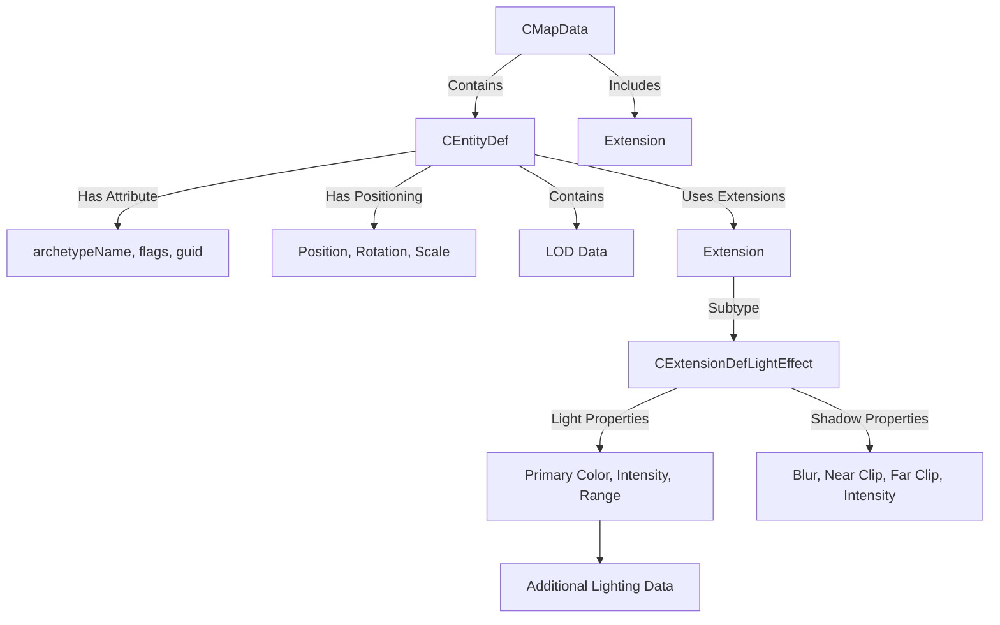
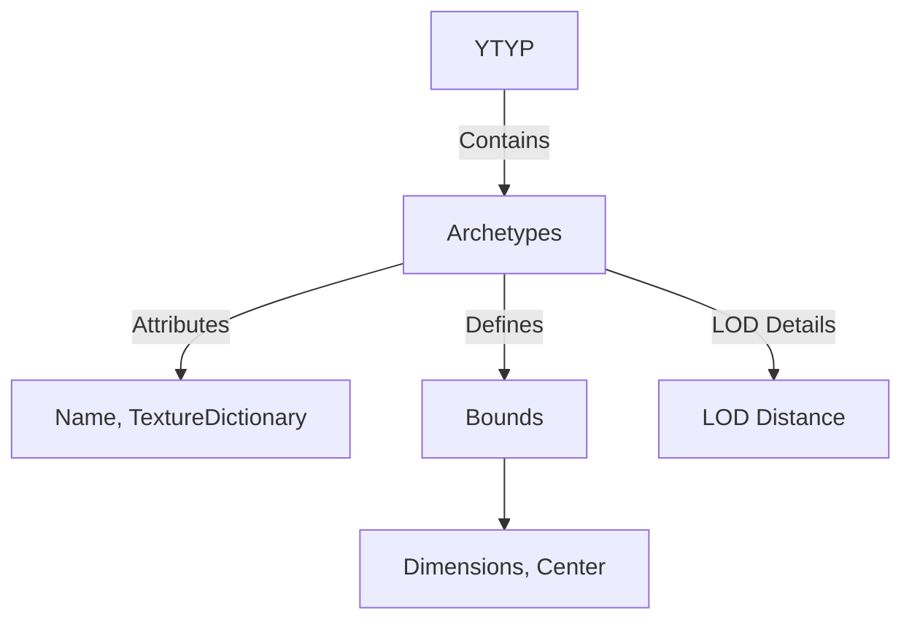
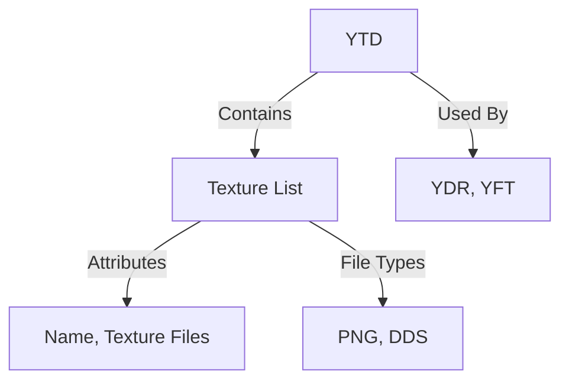
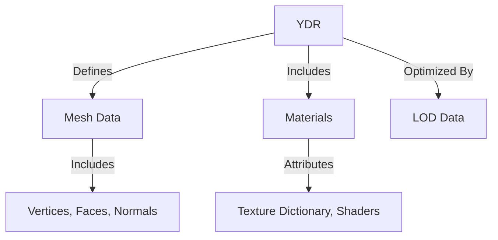
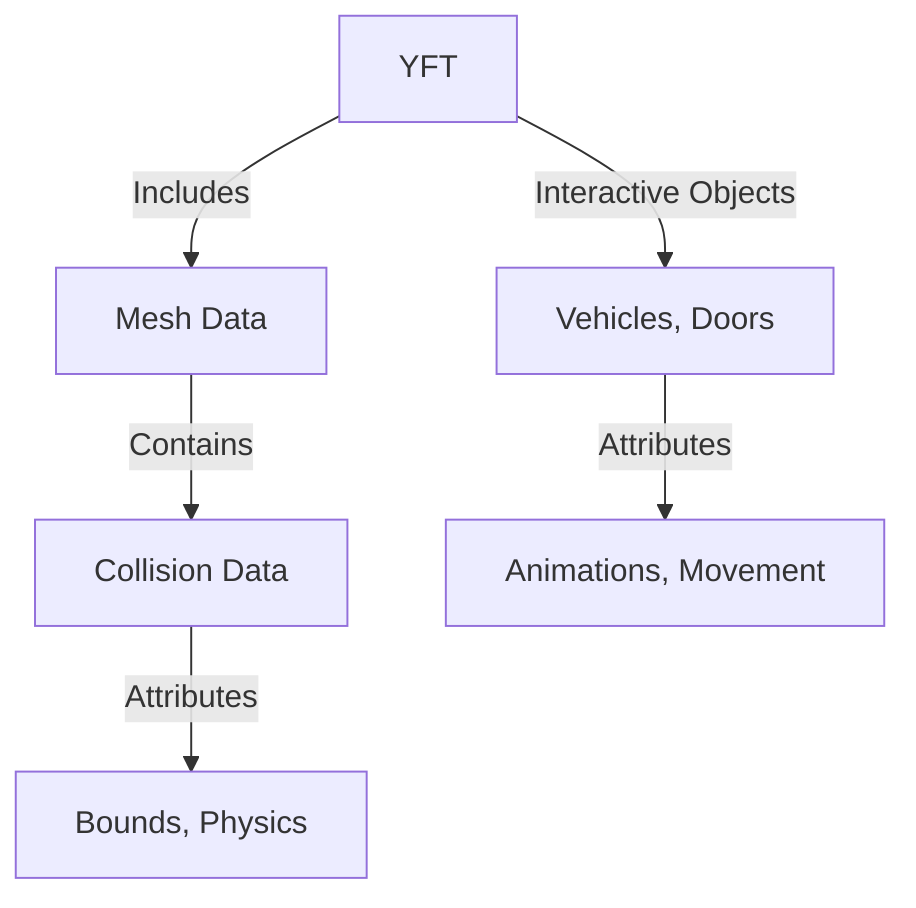
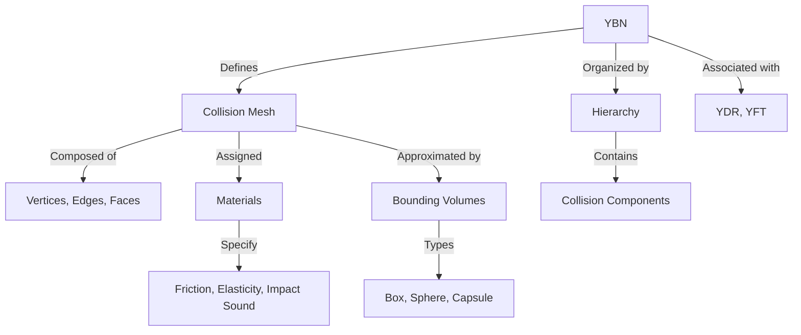
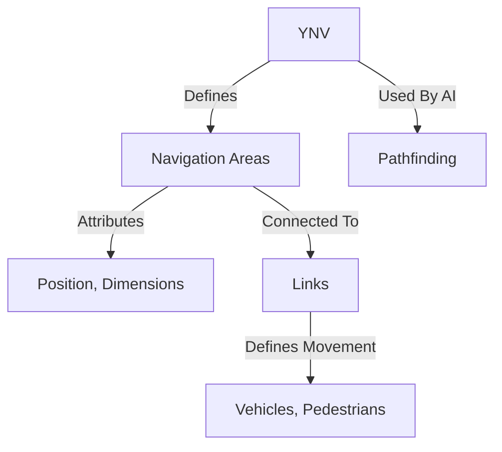
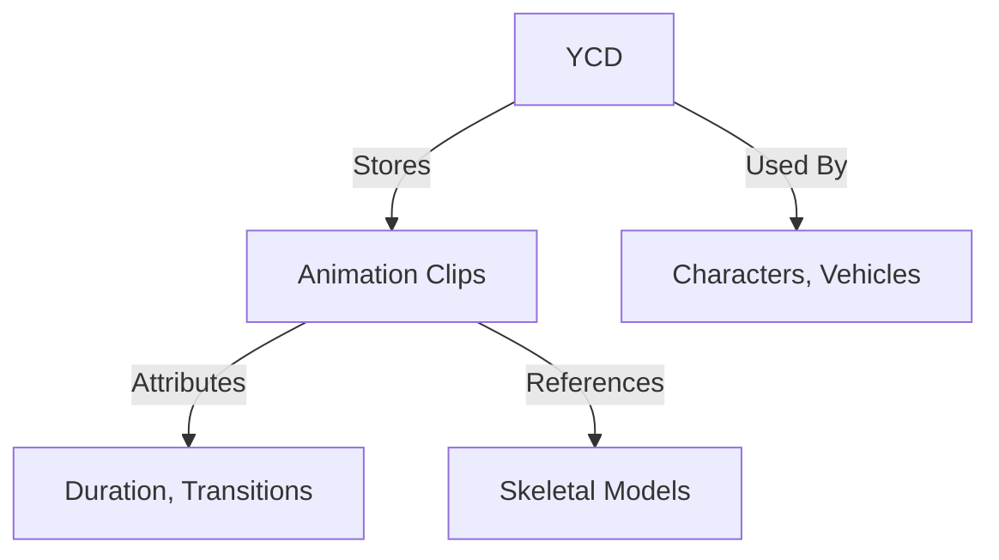

# Understanding GTA V file formats

Grand Theft Auto V uses a diverse range of file formats that define the game world, assets, and behaviors. Understanding these formats is critical for effective map modding and ensures your custom content integrates seamlessly into FiveM.

CodeWalker is a comprehensive tool that accurately parses and allows editing of these file formats. I strongly recommend using CodeWalker’s RPF Explorer as your primary tool for exploring and modifying GTA V’s file structure.

---

## Key file formats in GTA V

### **YMAP (Map Data)**

YMAP files define the placement and properties of objects within the game. This format serves as a blueprint for map design.

---

### **YTYP (Object Definitions)**

YTYP files define object archetypes, which include the reusable properties for map assets.

---

### **YTD (Texture Dictionary)**

YTD files are repositories of textures, used to apply visual details to models in `.ydr` or `.yft` files.

---

### **YDR (Drawable Models)**

YDR files are used for static or dynamic 3D objects.

---

### **YFT (Fragment Models)**

YFT files define interactive or dynamic objects, such as vehicles or doors.

---

### **YBN (Collision Bounds)**

YBN files define collision boundaries for various objects, ensuring appropriate physical interactions.

---

### **YNV (Navigation Mesh)**

YNV files provide navigation meshes for AI movement.

---

### **YCD (Clips Dictionary)**

YCD files store animation data for characters and objects.

---

## Review of file formats

1. **YMAP**: Place entities and props in the world
2. **YTYP**: Define reusable object archetypes
3. **YDR/YFT**: Provide models and interactive objects
4. **YTD**: Supply textures for visual representation
5. **YBN**: Define collision boundaries for physical interactions
6. **YNV**: Set up navigation for AI pathfinding
7. **YCD**: Define animations for characters and objects

---

This reference consolidates the core GTA V file formats and their interrelations for modding and custom map modding.