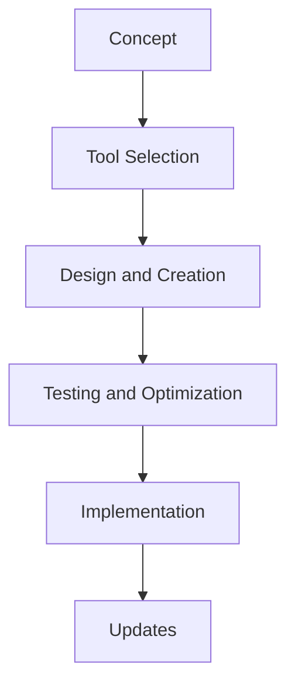
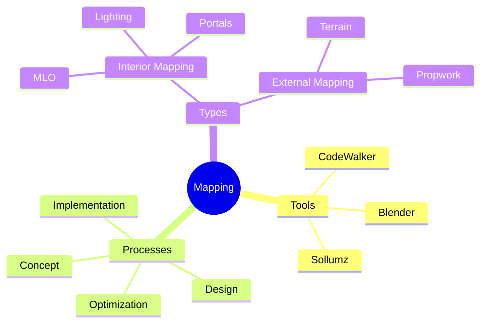

# What is Mapping?

My definition of mapping (map modding) is the process of creating, modifying, and enhancing the virtual environments within Grand Theft Auto V. It allows modders and developers to transform a server by adding new locations, customizing interiors, or improving existing areas. Mapping is an essential aspect of modding, as it not only adds aesthetic value but also enhances gameplay by creating immersive and functional spaces.

## Mapping Divisions

Personally, I categorize mapping into two primary types:

**Interior instance mapping (MLOs)**:

- Interior Instance mapping refers to creating or modifying interiors using instanced spaces.
- These are typically used for buildings, apartments, or other indoor environments where players can enter and interact.

**(cont.)**:

- Uses portals to connect rooms.
- Requires specific lighting and physics adjustments.
- Can be more complex due to collision and interior handling.

**External mapping (Non-MLO)**:

- External mapping refers to modifying or adding objects to the external game world.
- Includes outdoor environments like parks, roads, custom buildings, or large terrain edits.

**(cont.)**:

- Focuses on seamless integration with the game.
- Often involves terrain sculpting and object placement.
- Less complex than MLOs but requires attention to optimization.

---

## Effective mapping workflow

**Concept**:

- Define the purpose and vision for your map.

**Tool Selection**:

- Choose tools like CodeWalker, Blender, and Sollumz.

**Design and Creation**:

- Build your map by placing objects and defining details.

**Testing and Optimization**:

- Ensure performance and fix issues.

**Implementation**:

- Save and integrate the map into FiveM.

**Updates**:

- Make adjustments based on feedback.

---

## Tools and Processes

---

## Common Challenges in Mapping

**Performance Optimization**:

  - High polygon counts and unoptimized textures can reduce performance.
  - Use LODs (Levels of Detail) to balance quality and performance.

**Lighting Issues (MLOs)**:

  - Improper lighting and improper use of flags can break visual fidelity in MLOs.
  - Test different configurations to ensure proper visibility.

**Collision Flags**:

  - Ensure accurate collision data to prevent players from falling through objects.

---

By understanding the fundamentals of mapping and leveraging the right tools, you can create functional spaces that elevate your FiveM sever's map.
